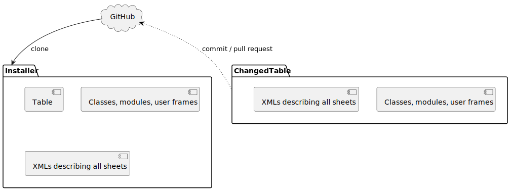

# VBA installer

## Why?
Excel files are in binary format, so it is hard to track their differences. 

## How?
I propose to distribute a single Excel file called "Installer" that loads sheets, modules, classes from accompanying XML files.



## Structure
For execution the installer needs XML files and modules stored in folder (see constant "backupDirectory"). The main XML file (constant "MainXmlFile", "main.xml") inside the directory contains the names of XML files corresponding to each created sheet.

An example of "main.xml" that contains one sheet ("Sheet1.xml"):
```xml
<WorkBook>
	<WorkSheets>
		<WorkSheet Path="Sheet1.xml" />
	</WorkSheets>
</WorkBook>
```

Each sheet' XML file contains following XML nodes:
* Cell
    * Type (not used yet)
    * Row
    * Column
    * Value
* Shape
    * Type (only "Button" can be used)
    * Left
    * Top
    * Width
    * Height
    * Text
    * Macro (macro name that will be executed on button press)
* Run
    * Function - a function that should be called.

An example of "Sheet1.xml":
```xml
<WorkSheet Name="Matrix Multiplication">
	<Shape Type="Button" Left = "250" Top = "150" Width = "80" Height = "35" Text="Multiply!" Macro = "MatrixMultiplication.MatrixMultiplication" />
	<Cell Type="string" Row = "1" Column = "6" Value = "M1" />
	<Cell Type="int" Row = "1" Column = "7" Value = "1" />
    <Run Function="DeleteInstallerSheet" />
</WorkSheet>
```

## Examples
* "Demo 1.xlsm" installs sources and one sheet with implementation of matrix multiplication.

## TODO:
* Add handling of references
* Add handling of cell formatting
* Add handling of user forms

Any contributions (proposals, discussions, pull requests) are welcome. 